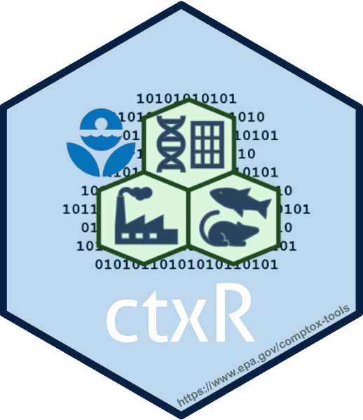

<!-- README.md is generated from README.Rmd. Please edit that file -->

# ctxR: Utilities for Interacting with the CTX APIs

Package website: [release](https://usepa.github.io/ctxR/) \|
[dev](https://usepa.github.io/ctxR/dev/)

<!-- badges: start -->

<!-- badges: end -->

## Welcome to the GitHub repository for the ctxR package

ctxR was developed to streamline the process of accessing the
information available through the [Computational Toxicology and Exposure
(CTX)
APIs](https://www.epa.gov/comptox-tools/computational-toxicology-and-exposure-apis)
without requiring prior knowledge of how to use APIs. Chemical, hazard,
bioactivity, and exposure data in available from the CTX APIs. Most data
is also available on the [CompTox Chemical Dashboard
(CCD)](https://comptox.epa.gov/dashboard/) or within other
[Computational Toxicology and Exposure Online
Resources](https://www.epa.gov/comptox-tools).

If you are interested in contributing or want to report a bug, please
submit a issue or start a discussion. See
[CONTRIBUTING](https://github.com/USEPA/ctxR/blob/dev/CONTRIBUTING.md)
for more information.

To install the current development version, run the following command:

    devtools::install_github("USEPA/ctxR")

Users don’t need a API key to install ctxR, but will need to supply an
API key to use ctxR and access data. A *FREE* API key can be obtained by
emailing the [CTX API Admins](mailto:ccte_api@epa.gov).

If you use [ctxR](https://cran.r-project.org/package=ctxR) in published
research, please cite the following paper:

Kruse, PM, Ring, CL, Paul Friedman, K, Feshuk, M, Brown, J, Thunes, C, &
Rashid, A. (2025). ctxR: Utilities for interacting with the CTX APIs.
**NAM Journal**, 100031. doi:
[10.1016/j.namjnl.2025.100031](https://doi.org/10.1016/j.namjnl.2025.100031)

### Disclaimer

The United States Environmental Protection Agency (EPA) GitHub project
code is provided on an “as is” basis and the user assumes responsibility
for its use. EPA has relinquished control of the information and no
longer has responsibility to protect the integrity, confidentiality, or
availability of the information. Any reference to specific commercial
products, processes, or services by service mark, trademark,
manufacturer, or otherwise, does not constitute or imply their
endorsement, recommendation or favoring by EPA. The EPA seal and logo
shall not be used in any manner to imply endorsement of any commercial
product or activity by EPA or the United States Government.
